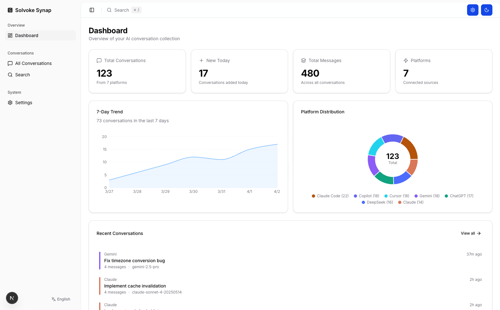
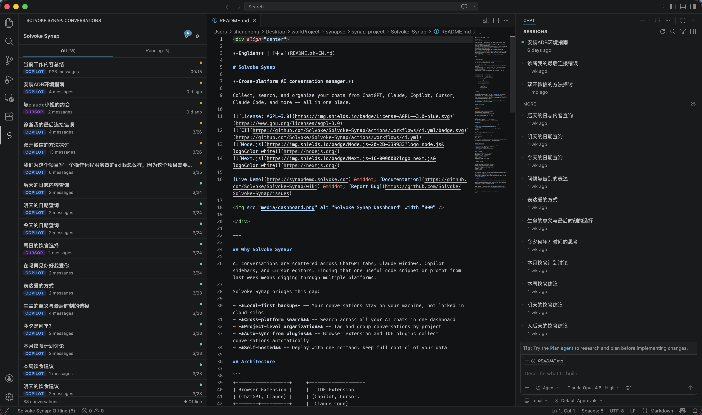
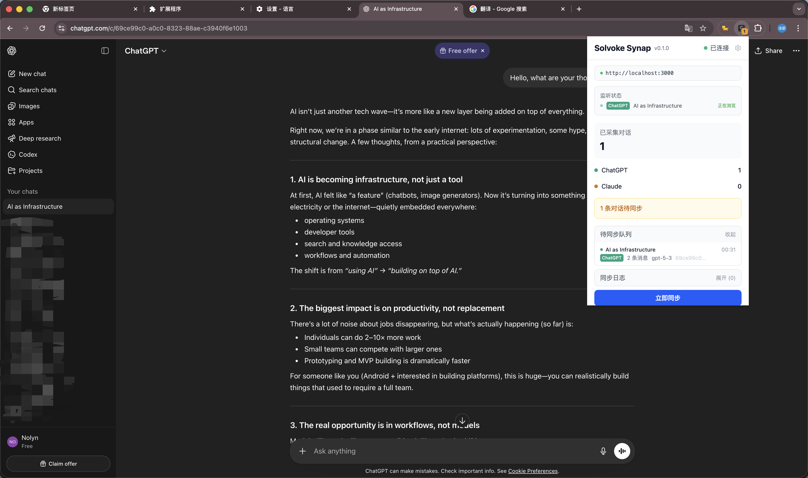

<div align="center">

**English** | [中文](README.zh-CN.md)

# Solvoke Synap

**Cross-platform AI conversation manager.**

Collect, search, and organize your chats from ChatGPT, Claude, Copilot, Cursor, Claude Code, and more -- all in one place.

[](https://www.gnu.org/licenses/agpl-3.0)
[](https://github.com/Solvoke/Solvoke-Synap/actions/workflows/ci.yml)
[](https://nodejs.org/)
[](https://nextjs.org/)

[Live Demo](https://synapdemo.solvoke.com) &middot; [Report Bug](https://github.com/Solvoke/Solvoke-Synap/issues/new?template=bug_report.yml) &middot; [Feature Request](https://github.com/Solvoke/Solvoke-Synap/issues/new?template=feature_request.yml)



</div>

---

## Why Solvoke Synap?

AI conversations are scattered across ChatGPT tabs, Claude windows, Copilot sidebars, and Cursor editors. Finding that one useful code snippet or prompt from last week means digging through multiple platforms.

Solvoke Synap bridges this gap:

- **Local-first backup** -- Your conversations stay on your machine, not locked in cloud silos
- **Cross-platform search** -- Search across all your AI chats in one dashboard
- **Project-level organization** -- Tag and group conversations by project
- **Auto-sync from plugins** -- Browser extension and IDE plugins collect conversations automatically
- **Self-hosted** -- Deploy with one command, keep full control of your data

## Architecture

```
+-------------------+     +-------------------+
| Browser Extension |     |   IDE Extension   |
| (ChatGPT, Claude) |     | (Copilot, Cursor, |
+--------+----------+     |  Claude Code)     |
         |                 +--------+----------+
         |    REST API (sync)       |
         +------------+-------------+
                      |
                      v
         +------------+-------------+
         |        synap-web         |
         |   Dashboard + API Server |
         +------------+-------------+
                      |
                      v
              +-------+-------+
              |  PostgreSQL   |
              +---------------+
                      |
              @synap/core (shared types)
```

## Ecosystem

<div align="center">
  
  
  <p><em>Left: VSCode/Cursor IDE Extension &nbsp;|&nbsp; Right: Chrome Browser Extension (ChatGPT)</em></p>
</div>

| Component | Install |
|-----------|--------|
| **synap-web** (Dashboard + API) | [Docker or npm](#quick-start) |
| **@synap/core** (Shared library) | npm |
| **Browser Extension** (Chrome/Edge) | [GitHub Releases](https://github.com/Solvoke/Solvoke-Synap/releases) |
| **IDE Extension** (VSCode/Cursor) | [GitHub Releases](https://github.com/Solvoke/Solvoke-Synap/releases) |

> The data layer (core + web) is open-source under AGPL-3.0 so you can audit the code that handles your data. The plugins are proprietary and currently available via GitHub Releases.

## Quick Start

### Docker (recommended)

```bash
git clone https://github.com/Solvoke/Solvoke-Synap.git
cd Solvoke-Synap
./deploy.sh
```

The deploy script handles everything automatically:
- Checks Docker and Docker Compose availability
- Generates a secure database password
- Detects port conflicts and picks an available port
- Starts PostgreSQL + synap-web and waits for health check

Open **http://localhost:3000** when it's ready.

#### Options

```bash
SYNAP_PORT=8080 ./deploy.sh           # Custom port
SYNAP_DB_PASSWORD=mypass ./deploy.sh   # Custom DB password
```

### Development

**Prerequisites:** Node.js 20+, PostgreSQL 15+ (or Docker), npm

```bash
git clone https://github.com/Solvoke/Solvoke-Synap.git
cd Solvoke-Synap

# Install dependencies (auto-builds core + generates Prisma Client)
npm install

# Configure database
cp packages/web/.env.example packages/web/.env
# Edit .env with your PostgreSQL connection string

# Run migrations
cd packages/web && npx prisma migrate deploy && cd ../..

# Start dev server
npm run dev
```

The `dev` command checks that `@synap/core` is built and Prisma Client is generated before starting. If anything is missing, it rebuilds automatically.

### Scripts

| Command | Description |
|---------|-------------|
| `npm run dev` | Start web dev server (auto-checks deps) |
| `npm run build` | Build core + web for production |
| `npm run test` | Run all tests (core: 61 tests) |
| `npm run lint` | Lint core + web |
| `npm run typecheck` | TypeScript type checking |

## Tech Stack

| Layer | Technology |
|-------|-----------|
| Monorepo | npm workspaces |
| Shared library | TypeScript, zod, nanoid |
| Web framework | Next.js 16 (App Router) |
| Database | Prisma v7 + PostgreSQL |
| UI | TailwindCSS v4, shadcn/ui |
| i18n | next-intl (en, zh-CN) |
| State | Zustand |
| Code quality | Biome (lint + format) |
| Testing | Vitest |
| CI/CD | GitHub Actions |

## Supported Platforms

| Platform | Collection Method | Status |
|----------|------------------|--------|
| ChatGPT | Browser Extension (network intercept) | Available |
| Claude | Browser Extension (network intercept) | Available |
| GitHub Copilot | IDE Extension (local file watch) | Available |
| Cursor | IDE Extension (local file watch) | Available |
| Claude Code | IDE Extension (local file watch) | In Development |

## Roadmap

Upcoming platform support and features:

- **Claude Code** -- Full IDE extension support (in development)
- **DeepSeek** -- Browser extension adapter
- **Gemini Web** -- Browser extension adapter
- **OpenClaw** -- Browser extension adapter
- **Google Antigravity** -- Browser extension adapter
- **Project Management** -- Organize conversations into projects with notes and context
- **AI Summary** -- Auto-generate conversation summaries and key takeaways

## Contributing

Contributions are welcome!

- Use **English** for code, comments, and commit messages
- Commit format: [Conventional Commits](https://www.conventionalcommits.org/) (e.g., `feat: add search filter`)
- Run `npm run lint && npm run test` before submitting a PR

### CI/CD

Every push and PR triggers GitHub Actions CI:

1. **Install** -- `npm ci` with dependency cache
2. **Build** -- `npm run build` (core + web)
3. **Test** -- `npm run test` (Vitest)
4. **Lint** -- `npm run lint` (Biome for web, ESLint for core)
5. **Type Check** -- `npm run typecheck`

All checks must pass before merging.

### Copilot Instructions & Skills

This repo includes `.github/copilot-instructions.md` and `.github/skills/` for AI-assisted development. If you use GitHub Copilot or similar tools, these files provide project-specific coding conventions and workflows.

## License

This project is licensed under **AGPL-3.0**. See [LICENSE](packages/core/LICENSE) for details.

The AGPL license ensures that modifications to the data layer remain open-source, protecting user trust while allowing self-hosting.

## Acknowledgments

The web dashboard UI is built on top of [next-shadcn-admin-dashboard](https://github.com/arhamkhnz/next-shadcn-admin-dashboard) by [@arhamkhnz](https://github.com/arhamkhnz) (MIT License).

---

<div align="center">
  <sub>Built by <a href="https://github.com/Solvoke">Solvoke</a></sub>
</div>
